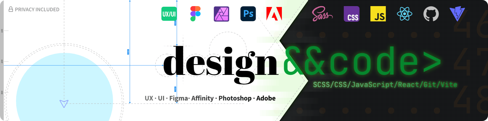

    <a href="https://svatos.dev" target="_blank" rel="noopener noreferrer">
        <picture>
          <source media="(prefers-color-scheme: dark)" srcset="./images/banner--dark.png">
          
        </picture>
    </a>

# Hi! Nice to see you here 👋

I'm self-taught Frontend Developer, Graphic Designer and UX enthusiast with more than 10 years of experience in different areas. I'm a privacy advocate, open source enthusiast and aspiring digital
minimalist.

- 📍 Based in Ontario, **Canada** 🇨🇦
- 🔭 **Looking for a meaningful job that solves actual problem for people**
- ❤️‍🔥 I love CSS, frontend web development, tweaking, refactoring and design and art in general
- ⚙️ **I thrive on making things work better and more efficiently**
- ✉️ Feel free to contact me on my [website](https://svatos.dev). Alternatively [Behance](https://www.behance.net/michalsvatos) or [LinkedIn](https://www.linkedin.com/in/michalsvatos/)
- 🌐 no social networks, sorry 🤷
-  <a href="https://torontojs.com/">Techlore</a> website creator
-  <a href="https://torontojs.com/">TorontoJS</a> contributor
-  <a href="https://pi-hole.net/">Pi-hole</a> Star Trek inspired <a href="https://github.com/MichalSvatos/pi-hole-star-trek-picard/">theme</a> creator

### Some languages and tools I use

                             

## Projects

#### Currently working on

|                                    |
|-------------------------------------------------------------------------------------------------------------------------------------------------------------------------------|
| Complete website overhaul for [Techlore](https://techlore.tech) based on Jekyll and Bulma framework. Source code on Techlore's [Github](https://github.com/techlore/website). |

|  |
|---------------------------------------------------------------------------------------------------------------------------------------------------------------------------------------------------------------------|
| LCARS Theme for [Pi-hole](https://github.com/pi-hole/pi-hole) dashboard. Written completely from scratch with pure CSS.                                                                                             |

#### Previous ones

|                                                                      |
|--------------------------------------------------------------------------------------------------------------------------------------------------------------------------------------------------------------------------------|
| Simple PWA to share text information on the screen of your device. Great in combination with [SimpleLogin](#some-projects-and-people-i-support). Design inspired by the Pip-Boy wearable computer from the Fallout video game. |

|  |
|-----------------------------------------------------------------------------------------------------------------------------------------------------------------|
| Website with a list of institutions and campaigns to support Italy with their fight against COVID-19 during the pandemic in 2020.                               |

***

#### Favorite quote

> _“It is so easy to be wrong - and to persist in being wrong - when the costs of being wrong are paid by others.”_  
> _-- Thomas Sowell_

### Some projects and people I support

<table>
  <tr>
    <td align="center" width="120">
      
       <a href="https://signal.org/" rel="noopener noreferrer">Signal</a>
    </td>
    <td align="center" width="120">
      
       <a href="https://mullvad.net/" rel="noopener noreferrer">Mullvad VPN</a>
    </td>
    <td align="center" width="120">
      
       <a href="https://simplelogin.io/" rel="noopener noreferrer">SimpleLogin</a>
    </td>
    <td align="center" width="120">
      
       <a href="https://proton.me/" rel="noopener noreferrer">Proton</a>
    </td></tr><tr>
    <td align="center" width="120">
      
       <a href="https://joplinapp.org/" rel="noopener noreferrer">Joplin</a>
    </td>
    <td align="center" width="120">
      
       <a href="https://www.techlore.tech/" rel="noopener noreferrer">Techlore</a>
    </td>
    <td align="center" width="120">
      
       <a href="https://www.youtube.com/PatrikKorenar" rel="noopener noreferrer">Patrik Kořenář</a>
    </td>
    <td align="center" width="120">
      
       <a href="https://ente.io" rel="noopener noreferrer">Ente</a>
    </td>
  </tr>
</table>

### Interesting books I've read recently

<table>
  <tr>
    <td width="180">
        
    </td>
    <td>
        <h3><a href="https://bookwyrm.social/book/67191/s/the-demon-haunted-world">The Demon-Haunted World: Science as a Candle in the Dark (Carl Sagan)</a></h3>
Sagan's message about the necessity of critical thinking and skepticism in a world often clouded by superstition and misinformation resonates deeply with me. However, while I found the book to be hopeful and inspiring, in the context of today's anti-science climate, it also filled me with a sense of despair.

    </td>
  </tr>
  <tr>
    <td width="180">
        
    </td>
    <td>
        <h3><a href="https://bookwyrm.social/book/1239499/s/the-martian">The Martian (Andy Weir)</a></h3>
        
While to movie is great - read the book!

    </td>
  </tr>
  <tr>
    <td width="180">
        
    </td>
    <td>
        <h3><a href="https://bookwyrm.social/book/322174/s/stolen-focus">Stolen Focus: Why You Can't Pay Attention- and How to Think Deeply Again (Johann Hari)</a></h3>
<i>"I wondered if the motto for our era should be: I tried to live, but I got distracted.”</i>

    </td>
  </tr>
  <tr>
    <td width="180">
        
    </td>
    <td>
        <h3><a href="https://bookwyrm.social/book/263439/s/mindfck-cambridge-analytica-and-the-plot-to-break-america">Mindf*ck: Cambridge Analytica and the Plot to Break America (Christopher Wylie)</a></h3>
<strong>You want to read this book!</strong> Especially if you're using any Meta products.

    </td>
  </tr>
</table>